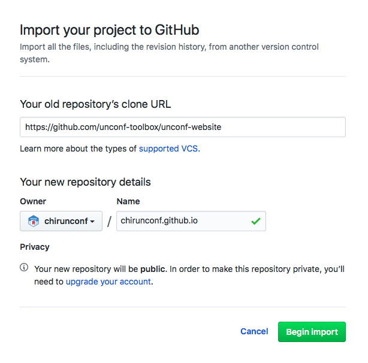

# unconf-website

This repository provides a template for setting up your unconf website. You can find a demo of this site [here](https://unconf-toolbox.github.io/unconf-website/).

Note: _Don't fork this repository directly on GitHub._ Instead, follow the instructions below to use Github's importer to copy this `unconf-website` repository and customize it for your workshop. This will make it so that you don't have to worry about upstream changes to our `unconf-website` repository.

## Creating a Repository

1.  Log in to GitHub.
    (If you do not have an account, you can quickly create an organization account for free.)
    You must be logged in for the remaining steps to work.

2.  Go to <a href="https://github.com/new/import" target="_blank">GitHub's importer</a>.

3.  Paste the url of this repo as the old repository to clone:
    <https://github.com/unconf-toolbox/unconf-website>.

4.  Select the owner for your new repository.
    (This will probably be your Github organization, such as "chirunconf".)

5.  Choose a name for your workshop website repository.
    If you are using a Github organization, this name should have the form "<organization-name>.github.io", such as `chirunconf.github.io`.

6.  Make sure the repository is public.

7.  You should now have something that looks like this: 

Click "Begin Import".
    When the process is done,
    you will receive a message like
    "Importing complete! Your new repository chirunconf/chirunconf.github.io is ready."
    and you can go to the new repository by clicking on the name.

## Customizing Your Website

1.  Go into your newly-created repository,
    which will be at `https://github.com/your_organization/your-organization.github.io`.
    For example,
    if your organization name is `chirunconf`,
    the repository's URL will be `https://github.com/chirunconf/chirunconf.github.io`.

You can now either clone this repository and work on this locally, or edit `config.toml` in the Github browser. [NOTE: site does not currently build automatically without being re-served locally, so ignore the second part of this sentence for the time being.]

2.  Edit all the places it says FIXME in `config.toml`. **Also, make sure to change `baseurl` to your own website address, such as "https://chirunconf.github.io/"**, otherwise none of the site formatting or images will show up (because the relative file paths will be wrong). If you've cloned this template locally, you can check your edits by running `blogdown::serve_site()` after making changes. The site will be published to the `docs` folder, which Github pages will automatically build into a website when you push your changes.

3. Add your logo and additional images (cover photo, venue photo, participant photos) in the `static/img` folder.

4. To include or exclude sections of the website, change the `enable = true` parameter to `enable = false`. 

4. (Optional, to make your life easier) Add the published website URL to the URL section in the Github repo (at the top of the page).

5. (Optional, to clean up your repository) Delete the `figs` folder, which is just for the README on the website template. 

6. (Optional, to clean up your repository) Rewrite this README to be something more descriptive of your unconf.

## Credits 

- The unconf template is forked from @njtierney's [ozunconf 2018 website repository](https://github.com/ropensci/ozunconf18), which is based off of the Hugo @ropensci [website theme](https://github.com/ropensci/ozunconf18/tree/master/themes/hugo-ropensci-theme). Thanks to both for their beautiful open source websites! 
- This README is inspired by the Software Carpentry [workshop website template](https://github.com/carpentries/workshop-template).
- This template was created at the [Chicago R Unconference](https://chirunconf.github.io) by Sam Tyner and Angela Li
